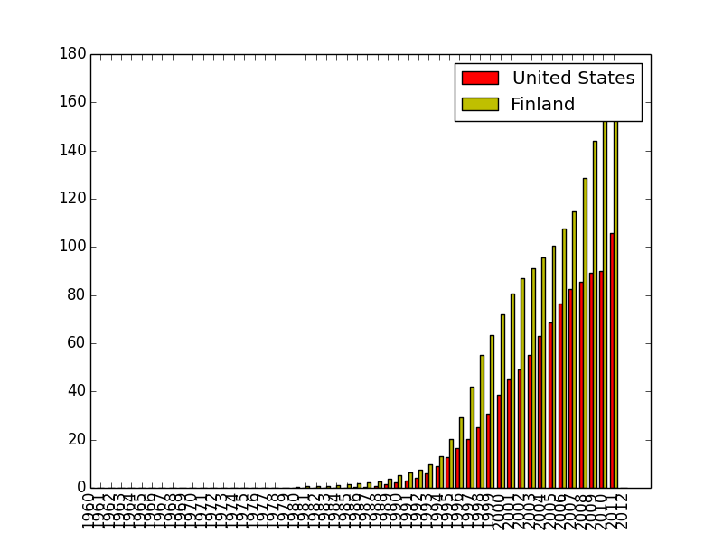
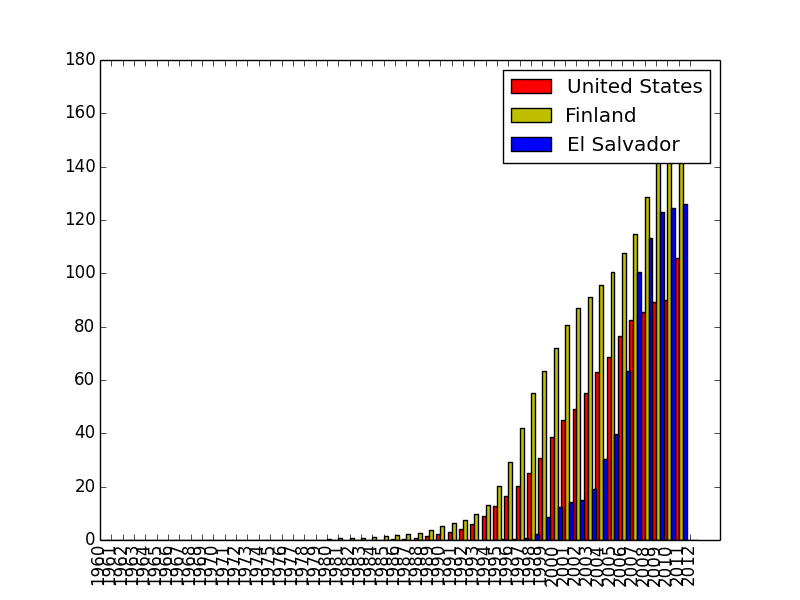
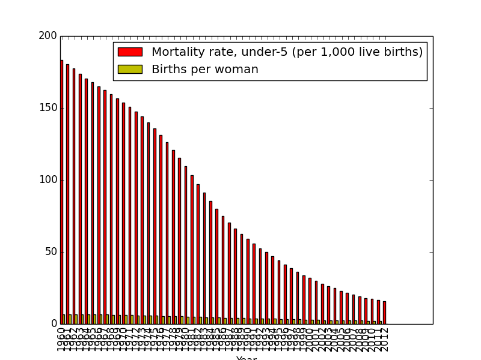

title: Python for Social Scientists
author:
  name: Renee Chu
  twitter: "@reneighbor"
  url: https://www.surveymonkey.com/s/pycon2014_tutorials
output: slides.html
controls: true

--
# Python for Social Scientists

## Tutorial, PyCon 2014 Montreal

--
### Prereqs:

* python
* matplotlib
* numpy
* text editor

--
### Survey of programming levels in the audience

--
### My background

* Econ major, liberal arts college
* No coding at school
* First job in sales and support
* Learned coding through workshops (Railsbridge and PyLadies) and online (Stanford Engineering Everywhere, Learn Python the Hard Way)

--
### Advice I received:

Pick a project you're passionate about.

--
### Hacking on data is:

* Interesting
* Widely available
* Easier setup than web

--
### Answer some interesting questions:

Should development resources be spent on family planning or fighting disease?
http://www.tubechop.com/watch/2507136

<iframe width="560" height="315" src="http://www.tubechop.com/watch/2507136" frameborder="0" allowfullscreen></iframe>

--
### What would we need to be able to verify this on an empirical level for at least one country?

* Childhood mortality across years
* Births per woman across years

--
### World Bank Data Indicators page
* Thousands of indicators 
* 214 Countries
* 1960-2012
* http://data.worldbank.org/indicator

--
### Answer some other interesting questions:

--
### Answer some other interesting questions:

Who has more mobile phone subscriptions per 100 people:
* Finland
* United States

--
## Mobile phone subscriptions per 100 people, 1960-2011

Source: World Bank, http://data.worldbank.org/indicator/IT.CEL.SETS.P2
--
### Answer some interesting questions:

Who has more mobile phone subscriptions per 100 people:
* Finland
* United States
* El Salvador

--
## Mobile phone subscriptions per 100 people, 1960-2011

--
### Varying costs of cellphone plans

* US: $59.00/mo
* Finland: $40.10/mo
* India: $12.90/mo

Unbundled postpaid total package (voice+sms+data) plans available to individual consumers. 
Open Technology Initiative (http://newamerica.net/publications/policy/an_international_comparison_of_cell_phone_plans_and_prices)

--
### Price information from one (largest) carrier

Tigo El Salvador "Basic" mobile postpaid, per min:
 
* Between Tigo: $0.08
* Other networks: $0.13
* Landlines: $0.13
* To USA/Canda: $0.09

http://www.tigo.com.sv/planes-pospago

--
### Today we're going to:

1. Import CSV data into Python
2. Find a MatPlotLib example
3. Pipe our CSV data into MatPlotLib

--
# 1. Import CSV data into Python

--
### Get started:

In your folder for personal projects:

git clone https://github.com/reneighbor/python-for-social-scientists.git

--
### What's here?

python_for_social_scientists/
* data/
*	-	fertility.csv
*	-	childhood_deaths.csv
*	read_data.py
*	chart_csv.py

--
### Running a dead-simple program

* Open up the folder
* Open up "read_data.py"
* Type:

	print "Hello world"

--
### Find your new file in your terminal

	cd Projects/personal-projects/programming-for-social-scientists
	python read_data.py

You should see "Hello World" spit back at you

--
### Follow these steps:

[Erase the print statement]

	import csv

* libraries are a bunch of functions and helpers written by other people

--
### Follow these steps:

	import csv

	csvfile = open('data/childhood_deaths.csv', 'rU')

--
### Follow these steps:

	import csv

	csvfile = open('data/childhood_deaths.csv', 'rU')
	reader = csv.DictReader(csvfile)

* DictReader lets you traverse the contents the csv file like a dictionary

--
### This is a Python dictionary

	{
		'Country Name': 'Finland', 
		'Country Code': 'FIN', 
		'2007': '114.924474', 
		'2008': '128.4719884',
		'2009': '144.1530224'
	}

--
### * This is a Python dictionary

	{
		'2007': '114.924474',
		'2009': '144.1530224' 
		'Country Name': 'Finland', 
		'2008': '128.4719884',
		'Country Code': 'FIN',
	}

--
### Follow these steps:

	import csv

	csvfile = open('data/childhood_deaths', 'rU')
	reader = csv.DictReader(csvfile)

	for row in reader:
		print row

--
### Follow these steps:

Run it! In your terminal:

	cd Projects/personal-projects/programming-for-social-scientists
	python read_data.py

--
### Follow these steps:

	import csv

	csvfile = open('data/childhood_deaths', 'rU')
	reader = csv.DictReader(csvfile)

	for row in reader:
		if row['Country Name'] == "Finland":
			print row

--
### Any questions?

--
### What are some things we observe about the output?

--
### What are some things we observe about the output?
* Not sorted
* Data in strings
* Every row

--
# 2. Find a MatPlotLib example

--
### Find something to copy

http://matplotlib.org/gallery.html

--
### Examine the code-- What do we know?

* First half is drawing the rects, second is labels
* Values the list

--
### Run the sample code

* Create a new file "mens_womens.py" inside python_for_social_scientists
* In your terminal run "python mens_womens.py"
* Do you get the chart?
* Edit the values for "menMeans" and "womensMeans". Do you see a change?

--
### MatPlotLib Bar chart simplified

* Look at basic_chart.py

--
### In your terminal:

	python basic_chart.py

--
### In your text editor:

How do we get the other countries data?
* In basic_chart.py add 2 series, el_salvador_data and usa_data
* Uncomment the commented-out lines
* Run it again

--
### Piping in the CSV data

* open chart-csv.py
* What needs to be done in order to extract data?

--
### Piping in the CSV data

What needs to be done in order to extract data?
* Turn data from strings into ints
* Stip out county names
* Sort by year

--
### Give it a try

--
Break

--
### Share what you've written

--
### Comparing 2 countries
* How would you edit chart_csv to graph multiple countries?

--
### Comparing 2 countries
* run extractData() on 2 other countries
* comment out the rectangle-drawing for those countries

--
### Comparing 2 indicators

What do we need to do to compare mortality against fertility?

--
### Comparing 2 indicators

What do we need to do to compare mortality against fertility?
* Take in 2 CSV readers
* Take in only one country
* rename "rects" to be indicators instead of countries

--
### From Github:

programming_for_social_scientists compare_indicators_starter.py

* Re-arranged to accomediate two comparison-drawing functions and a main()

--
### Give it a try

--
El Salvador 1960-2013

--
### Share what you've written

--
### What we've done:

* Imported a CSV and turned it into a dict
* Went to MatPlotLib and found a bar chart to borrow
* Drew a series comparing countries from one CSV
* Drew a series comparing indicators from two CSVs

--
### Your Turn

* Pick a data set that interests you. 
* Write code to visualize it. 
* Teach us something!
